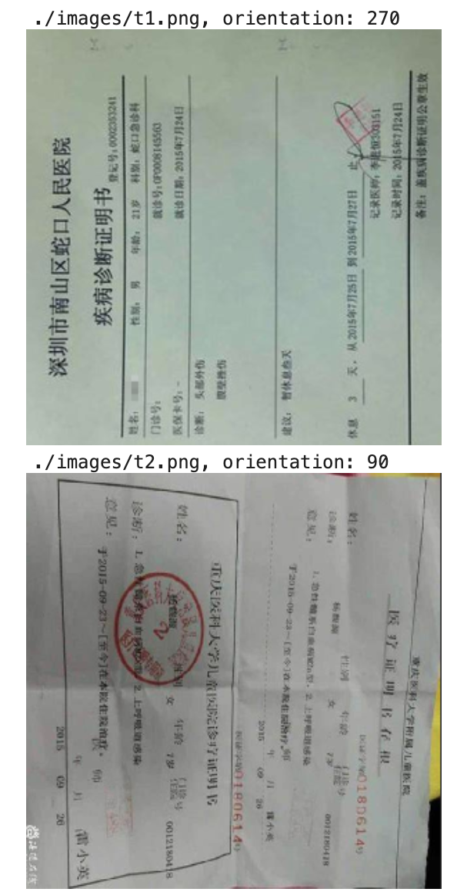
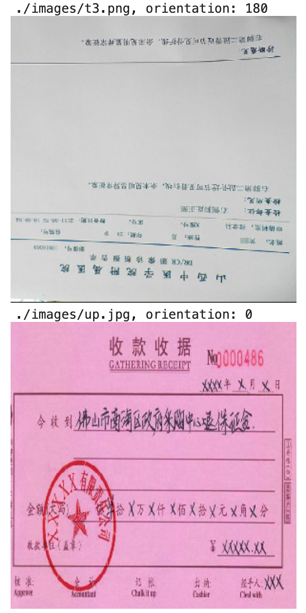
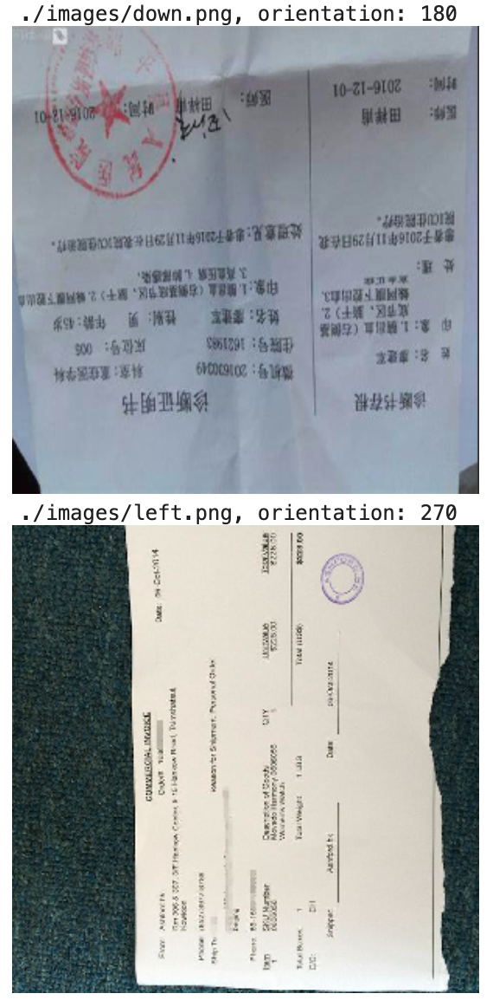

# detect_image_orientation
detect image orientation with CNN

### 使用CNN检测图像方向
为了提高OCR中文字检测模型的准确率，想着训练一个模型来检测文字方向，然后根据判断的方向先提前把图像给调正了。

因为我们这边的图片都是一些票据，账单之类的，而且文字检测模型也有一定的角度适应能力，所以这里只是定四个角度0,90,180,270。

在我的训练集下训练好的model可以从这里下载（我的验证集下accuracy是95%）： https://www.yun.cn/s/4120dc888b5d454ba2197ec4705f04e7


使用方式见demo notebook文件

```
import numpy as np
from glob import glob
from keras.preprocessing import image
from keras.models import load_model
from IPython.display import display

model = load_model('vgg19-256-512.h5')


def predict(img_path):
    angle = {
        0: 0, 
        1: 180, 
        2: 270, 
        3: 90
    }

    valid_image = image.load_img(img_path, target_size=(224, 224))
    image_arr = image.img_to_array(valid_image)
    idx = np.argmax(model.predict(np.expand_dims(image_arr, 0)),axis=1)
    print(f'{img_path}, orientation: {angle[idx[0]]}')
    display(image.load_img(img_path, target_size=(300, 300)))

for p in glob('./images/*.png'):
    predict(p)
```





